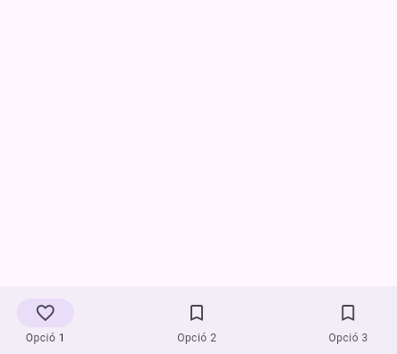
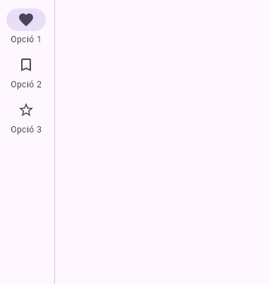

# Disseny adaptatiu en Flutter

## Disseny responsiu i adaptatiu

Quan parlem de disseny adaptatiu i responsiu fem referència a com els dissenys (layouts) de la interfície d'usuari de les nostres adaptacions s'ajusten a la mida i l'orientació de la pantalla (*viewport*).

Això cobra especial rellevància, per una banda en web i escriptori, on podem variar la grandària de les finestres de l'aplicació, i en desenvolupament mòbil, on l'orientació del dispotitiu determina com es veu el contingut.

> [!Note]
>
> **Articles interessants**
>
> * [General approach to adaptive apps](https://docs.flutter.dev/ui/adaptive-responsive/general)
> * [Adaptive and responsive design in Flutter](https://docs.flutter.dev/ui/adaptive-responsive?utm_source=chatgpt.com)

Veiem breument la diferència entre **disseny adaptatiu** i **disseny responsiu**.

> [!Note]
> 
> * **Disseny Responsiu**: Integra la UI en l'espai disponible.
> * **Disseny adaptatiu**: Fer usable la UI en aquest espai.
> 
> Una app responsiva ajustarà els elements de disseny per adaptar-se a l'espai disponible, i l'adaptativa seleccionarà el disseny i els dispositius d'entrada adeqüats perquè aquest espai siga usable. Per exemple, faríem ús del mateix sistema de navegació (navegació inferior, barra lateral) per a un mòbil que per a una tauleta? Un disseny responsiu adaptaria els mateixos elements a l'espai disponible, mentre que un disseny adaptatiu seleccionaria, per exemple una barra de navagació inferior per al dispositiu mòbil i una barra lateral per a tauleta.
>
> | Barra de navegació inferior (widget NavigationBar) | Barra de navegació lateral (widget NavitationRail) |
> | -------------------------------------------------- | -------------------------------------------------- |
> |                                 |                               |

     
En Flutter disposem de diferents opcions per determinar el tipus de layout (disseny) i fer-lo adaptatiu, segons l'orientació i la mida del viewport.

### **MediaQuery**

Aquest mecanisme s'usa quan volem prendre decisions ràpides basades en l'amplada/alçada de la vista, el padding, etc.

Els principals avantatges que té:

* És molt directe i ens dona accés a moltes dades.
* Reacciona automàticament quan canvien només les propietats consultades.

I els desavantatges:

* Cal tenir en compte que obté informació global (grandària total de la pantalla, orientació...), però no ens permet adaptar un layout a l'espai disponible dins d'altre contenidor.
* Sovint utilitzem valors (sobretot per al padding) introduits de forma manual (8, 16...) que poden servir per a uns dispositiuis però no per a altres.

> [!Note]  "Documentació"
> 
> **Documentació**
> 
> * [Referència a l'API de Flutter](https://api.flutter.dev/flutter/widgets/MediaQuery-class.html)
> * [Vídeo MediaQuery.propertyOf (Technique of the Week)](https://www.youtube.com/watch?v=xVk1kPvkgAY)
> * [SafeArea & MediaQuery](https://docs.flutter.dev/ui/adaptive-responsive/safearea-mediaquery)
> * Article [Mastering the Art of Screen Adaptability with Flutter MediaQuery: A Beginner's Guide](https://www.dhiwise.com/post/mastering-screen-adaptability-with-flutter-mediaquery)

### **OrientationBuilder**:

Aquest és un mecanisme útil per detectar quan la UI canvia explícitament entre *portrait* (vertical) i *landscape* (horitzontal) i volem adaptar el disseny.

El principal avantatge que presenta és la seua senzillesa, ja que ens ofereix l'orientació i es reconstrueix quan aquesta canvia. Ara bé, només serveix per detecatar l'orientació, però no els canvis en les dimensions.

> [!Note]
> 
> **Documentació**
> 
> * [Update the UI based on orientation](https://docs.flutter.dev/cookbook/design/orientation)
> * [Referència a l'API d'OrientationBuilder](https://api.flutter.dev/flutter/widgets/OrientationBuilder-class.html)

### **LayoutBuilder**

Es tracta de l'opció més completa, i s'usa per crear dissenys responsius en funció de l'amplada i alçada del widget pare. És a dir, que té en compte l'espai disponible proporcionat per les restriccions del pare, no de tot el *viewport*. Aquest widget treballa amb trams d'amplada, coneguts com *breakpoints*.

Els principals avantatges d'aquest widget són que:

* Segueix la filosofia de [constraints go down](https://docs.flutter.dev/ui/layout/constraints), és a dir, els widgets pares proporcionen les restriccions als widgets fills.
* S’adapta bé a vises dividides (*split views*), escriptori, web o tauletes (i evidentment a mòbils).

> ![Note] 
> 
> **Consideracions de rendiment / desavantatges**
>
> Tal i com s'indica a l'article de documentació [LayoutBuilder optimization](https://docs.flutter.dev/release/breaking-changes/layout-builder-optimization):
> * Cal vigilar el nombre de reconstruccions (*rebuilds*): abans de Flutter v1.20.0 el builder (la funció `build` que construeix widget) podia cridar-se molt sovint fins i tot sense produir-se canvis en les restriccions (*constraints*), i això podia afectar el rendiment. 
> * A partir de v1.20.0, `LayoutBuilder` ha estat optimitzat perquè el builder **no es cride** si les constraints o la configuració del widget no canvien.
> * Amb aquesta optimització:
>   - Hi ha menys reconstruccions innecessàries, millorant així rendiment, però...
>   - Si la lògica del widget depenia implícitament d’aquestes reconstruccions (per exemple, canviant només una variable que no afecta a les restriccions), podriem veure que el builder no es torna a executar. Per tant, potser caldrà cridar `setState` o reorganitzar la lògica per forçar la reconstrucció.
> * La recomanació general és revisar si el builder s’ha de tornar a executar-se quan canvien les dades, i si és així, fer-ho explícitament.

> ![Info]
> 
> **Documentació**
> 
> * [Referència de la classe a l'API de Flutter](https://api.flutter.dev/flutter/widgets/LayoutBuilder-class.html)
> * [Understanding constraints](https://docs.flutter.dev/ui/layout/constraints)

## Projecte d'exemple

* En aquest repositori disposeu d'un exemple de disseny responsiu amb tres pantalles, cadascuna amb una aproximació diferent.